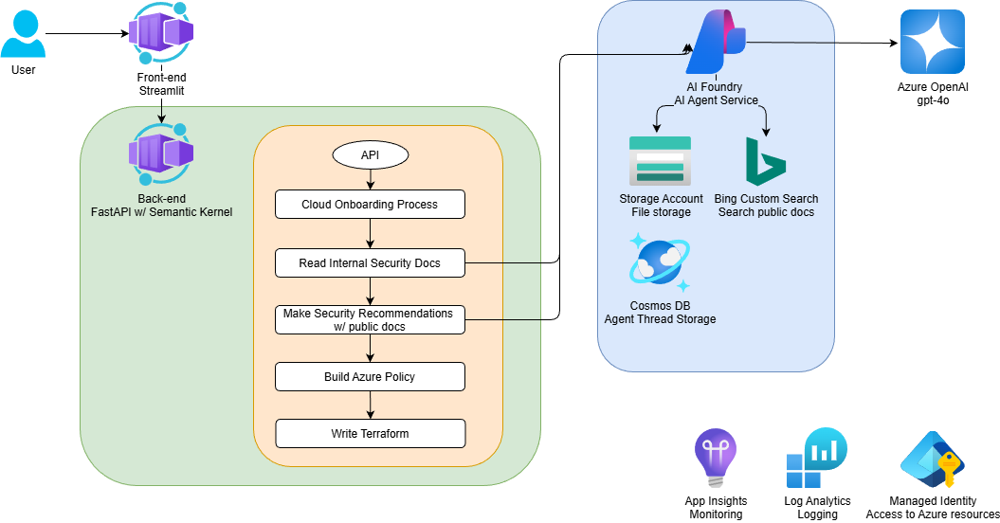
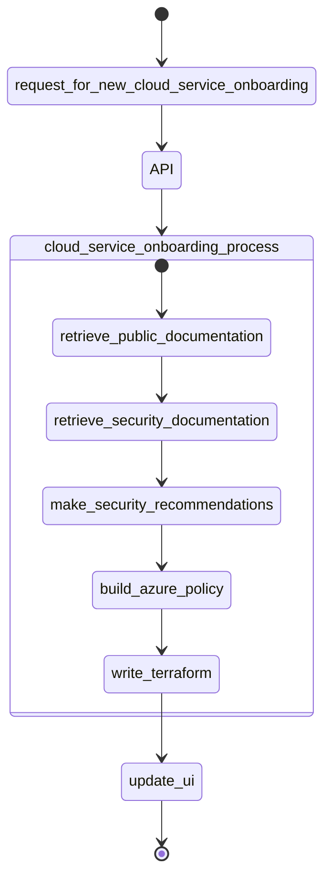

# cloud-service-onboarding-agent



## Cloud Service Onboarding Agent process


## Disclaimer

**THE SOFTWARE IS PROVIDED "AS IS", WITHOUT WARRANTY OF ANY KIND, EXPRESS OR IMPLIED, INCLUDING BUT NOT LIMITED TO THE WARRANTIES OF MERCHANTABILITY, FITNESS FOR A PARTICULAR PURPOSE AND NONINFRINGEMENT. IN NO EVENT SHALL THE AUTHORS OR COPYRIGHT HOLDERS BE LIABLE FOR ANY CLAIM, DAMAGES OR OTHER LIABILITY, WHETHER IN AN ACTION OF CONTRACT, TORT OR OTHERWISE, ARISING FROM, OUT OF OR IN CONNECTION WITH THE SOFTWARE OR THE USE OR OTHER DEALINGS IN THE SOFTWARE.**

## Prerequisites

- [Azure CLI](https://docs.microsoft.com/en-us/cli/azure/install-azure-cli)
- Azure subscription & resource group
- [Python](https://www.python.org/downloads/)

## Azure Resources needed

- Azure Container Apps
- Azure AI Foundry Service
  - OpenAI model (gpt-4o)
  - `Azure AI User` RBAC role
- Bing Custom Search
- App Insights
- Log Analytics
- Managed Identity
- Optional services for Bring-Your-Own model
    - Azure Storage Account
    - Azure Cosmos DB

## Deployment

## Local

Perform each of the following sections in a new shell window.

1.  Authenticate your local environment with Azure (this is used by the `DefaultAzureCredential` in code to authenticate)

    ```shell
    az login
    ```

1.  Create a `/src/api/.env` file for the backend service

    ```txt
    AZURE_OPENAI_MODEL_DEPLOYMENT_NAME=<your-openai-model-deployment-name>
    AZURE_AI_AGENT_ENDPOINT=<your-ai-agent-endpoint>
    AZURE_AI_AGENT_API_VERSION=2025-01-01-preview
    APPLICATION_INSIGHTS_CONNECTION_STRING=<your-app-insights-connection-string>
    BING_CONNECTION_NAME=<your-bing-connection-name>
    BING_INSTANCE_NAME=<your-bing-instance-name>
    ```

1.  Create a `/src/web/.env` file for the frontend service

    ```txt
    services__api__api__0=http://127.0.0.1:8000
    ```

### Individual terminals

#### Api

1.  Navigate into the `src/api` directory

    ```shell
    cd src/api
    ```

1.  Create a virtual environment

    ```shell
    python -m venv .venv
    ```

1.  Activate the virtual environment (Windows)

    ```shell
    ./.venv/Scripts/activate
    ```

1.  Install the prerequisites

    ```shell
    pip install -r ./requirements.txt
    ```

1.  Run the API

    ```shell
    python -m uvicorn app.main:app --log-level debug
    ```

#### Web

1.  Open a new shell

1.  Navigate to the `src/web` directory

    ```shell
    cd src/web
    ```

1.  Create a virtual environment

    ```shell
    python -m venv .venv
    ```

1.  Activate the virtual environment (Windows)

    ```shell
    ./.venv/Scripts/activate
    ```

1.  Install the prerequisites

    ```shell
    pip install -r ./requirements.txt
    ```

1.  Run the web app

    ```shell
    streamlit run ./app.py
    ```

1.  Navigate to the URL that is printed

### Docker Compose

1.  Navigate to the root of the repository

    ```shell
    cd src
    ```

1.  Create a `.env` file in the `src` directory with the following content. The UID & GID are the user ID and group ID of the user that will run the `azclicredsproxy` container. These are needed because the `azclicredsproxy` needs to be able to access the Azure CLI credentials stored in the `~/.azure` directory. If you are running `docker` from Linux, you don't need the `DISTRONAME` parameter.

    ```txt
    UID=
    GID=
    USERNAME=
    DISTRONAME=
    ```

1.  Update the `docker-compose.yml` file to select the appropriate volume mount for the `azclicredsproxy` service. Comment out one or the other volume mounts as needed.

1.  Run the following command to build & run the Docker images locally

    ```shell
    docker compose up --build
    ```

## Links
