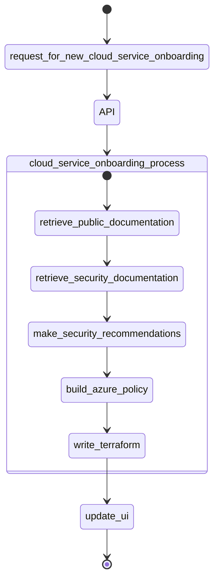

# cloud-service-onboarding-agent


## Cloud Service Onboarding Agent process


## Disclaimer

**THE SOFTWARE IS PROVIDED "AS IS", WITHOUT WARRANTY OF ANY KIND, EXPRESS OR IMPLIED, INCLUDING BUT NOT LIMITED TO THE WARRANTIES OF MERCHANTABILITY, FITNESS FOR A PARTICULAR PURPOSE AND NONINFRINGEMENT. IN NO EVENT SHALL THE AUTHORS OR COPYRIGHT HOLDERS BE LIABLE FOR ANY CLAIM, DAMAGES OR OTHER LIABILITY, WHETHER IN AN ACTION OF CONTRACT, TORT OR OTHERWISE, ARISING FROM, OUT OF OR IN CONNECTION WITH THE SOFTWARE OR THE USE OR OTHER DEALINGS IN THE SOFTWARE.**

## Prerequisites

- [Azure CLI](https://docs.microsoft.com/en-us/cli/azure/install-azure-cli)
- Azure subscription & resource group
- [Python](https://www.python.org/downloads/)

## Azure Resources needed

- Azure AI Foundry Service
  - OpenAI model (gpt-4o)
  - Grounding with Bing
  - Vector Store
  - AI Agent service
- Azure App Service
- Azure Storage Account


## Deployment

## Local

Perform each of the following sections in a new shell window.

### Api

1.  Navigate into the `src/api` directory

    ```shell
    cd src/api
    ```

1.  Create a `.env` file with the following values.

    ```txt
    AZURE_OPENAI_MODEL_DEPLOYMENT_NAME=
    AZURE_AI_AGENT_ENDPOINT=
    AZURE_AI_AGENT_API_VERSION=2025-01-01-preview
    APPLICATION_INSIGHTS_CONNECTION_STRING=
    BING_CONNECTION_NAME=
    BING_INSTANCE_NAME=
    SEMANTICKERNEL_EXPERIMENTAL_GENAI_ENABLE_OTEL_DIAGNOSTICS=true
    SEMANTICKERNEL_EXPERIMENTAL_GENAI_ENABLE_OTEL_DIAGNOSTICS_SENSITIVE=true
    ```

1.  Create a virtual environment

    ```shell
    python -m venv .venv
    ```

1.  Activate the virtual environment (Windows)

    ```shell
    ./.venv/Scripts/activate
    ```

1.  Install the prerequisites

    ```shell
    pip install -r ./requirements.txt
    ```

1.  Run the API

    ```shell
    python -m uvicorn app.main:app --log-level debug
    ```

### Web

1.  Open a new shell

1.  Navigate to the `src/web` directory

    ```shell
    cd src/web
    ```

1.  Create a virtual environment

    ```shell
    python -m venv .venv
    ```

1.  Activate the virtual environment (Windows)

    ```shell
    ./.venv/Scripts/activate
    ```

1.  Install the prerequisites

    ```shell
    pip install -r ./requirements.txt
    ```

1.  Run the web app

    ```shell
    streamlit run ./app.py
    ```

1.  Navigate to the URL that is printed

## Links
